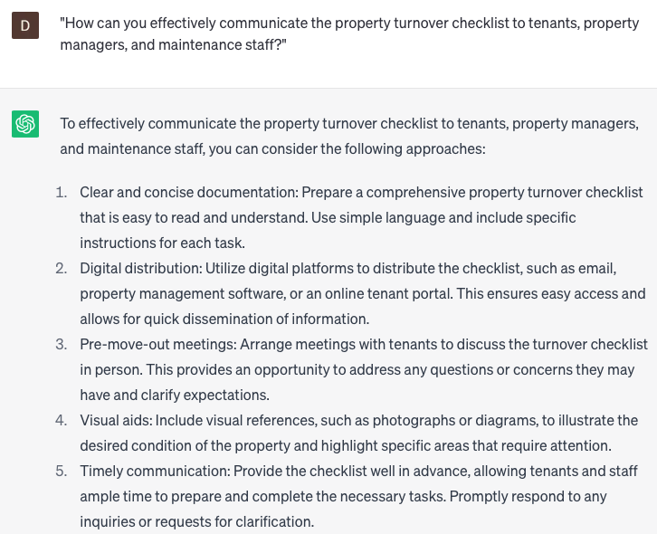

# Developing property turnover checklists

### FILL-IN-THE-BLANK **PROMPTS:**

```jsx
I'm seeking tips to streamline my property turnover checklist. Enhance efficiency in **[time management]**, **[cost-effectiveness]**, **[communication]**, and **[accountability]**. Aim for a smooth and hassle-free turnover process.
```

```jsx
Help me ensure clarity and conciseness in my property turnover checklist. Make it **[straightforward]**, **[jargon-free]**, and **[accesible]** to **[tenants]**, **[property managers]**, and **[maintenance staff]**. Avoid confusion and misunderstandings.
```

```jsx
I need suggestions to enhance my property turnover checklist. Specifically, regarding **[inspections]**, **[inventory]**, **[utilities]**, **[keys]**, and **[security]**. Focus on giving both tenant and property manager clear responsibilities.
```

### QUESTIONS-BASED P**ROMPTS:**

1. "What are the key tasks that should be included in a property turnover checklist?"
2. "How can you ensure that the property turnover checklist covers all necessary aspects, such as cleaning, maintenance, and repairs?"
3. "What specific items or areas should be inspected during the property turnover process?"
4. "How can you incorporate tenant responsibilities into the property turnover checklist?"
5. "What documentation should be included in the property turnover checklist, such as move-in/move-out forms and condition reports?"
6. "How can you effectively communicate the property turnover checklist to tenants, property managers, and maintenance staff?"
7. "What strategies can be implemented to streamline the property turnover checklist and make it more efficient?"
8. "How can you customize the property turnover checklist for different types of properties, such as apartments, condos, or houses?"
9. "What steps should be taken to ensure accountability and track progress when using the property turnover checklist?"
10. "How can you leverage technology or software to enhance the effectiveness of the property turnover checklist?"

### EXAMPLES:

