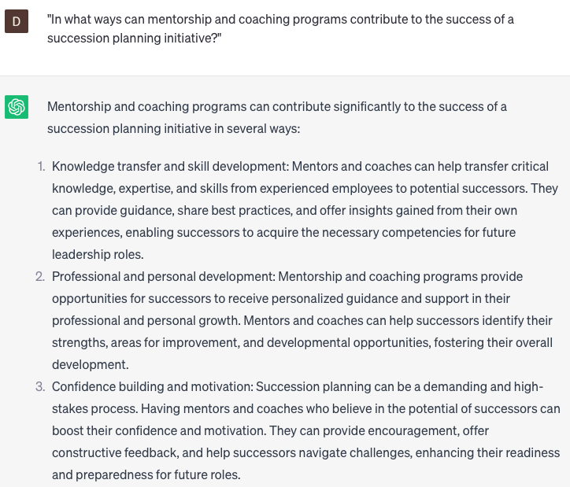

# Developing succession planning programs

### FILL-IN-THE-BLANK **PROMPTS:**

```jsx
What are the essential elements to take into consideration when establishing a succession planning program for **[insert company name]** in the **[insert industry]** industry, with careful attention given to factors including **[insert factor 1], [insert factor 2]**, **[insert factor 3]**, and **[insert factor 4]**?
```

```jsx
Could you provide recommendations for implementing effective strategies to identify and cultivate potential successors for **[insert job role]** in **[insert location]**, taking into account factors such as **[insert factor 1], [insert factor 2], [insert factor 3], [insert factor 4]**, and **[insert factor 5]**?
```

```jsx
What methods can we employ to assess the efficacy of our existing succession planning program for **[insert job role]** within **[insert department]**, utilizing metrics such as **[insert metric 1]**, **[insert metric 2]**, **[insert metric 3]**, **[insert metric 4]**, and **[insert metric 5]** to identify areas that require enhancement?
```

### QUESTIONS-BASED P**ROMPTS:**

1. "Why is it important for organizations to develop succession planning programs to identify and develop future leaders within the company?"
2. "What key elements should be considered when designing a succession planning program that ensures a pipeline of talented individuals ready to assume leadership roles?"
3. "How can organizations assess and identify high-potential employees as part of their succession planning efforts?"
4. "What strategies can be employed to provide targeted development opportunities and experiences for potential successors to prepare them for future leadership positions?"
5. "In what ways can mentorship and coaching programs contribute to the success of a succession planning initiative?"
6. "How can organizations create a culture that values and supports succession planning, encouraging employees to actively participate in the program?"
7. "What approaches can be used to ensure diversity and inclusion in succession planning efforts, promoting a broad range of perspectives and experiences in future leadership roles?"
8. "How can organizations address potential challenges or barriers in implementing a succession planning program and ensure its long-term sustainability?"
9. "What role can ongoing performance assessments and talent reviews play in supporting the identification and development of potential successors?"
10. "What measures should be taken to regularly evaluate and refine the succession planning program to align with evolving business needs and talent requirements?"

### EXAMPLES:

