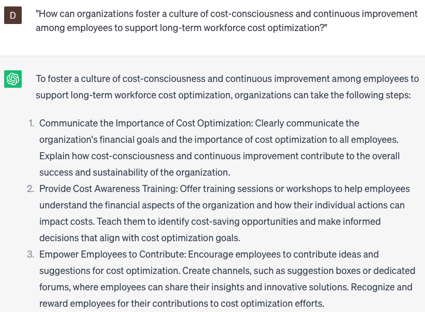

# Developing workforce cost optimization strategies

### FILL-IN-THE-BLANK **PROMPTS:**

```jsx
Could you share **[specific number]** case studies that exemplify successful workforce cost optimization strategies within the **[specific industry/sector]**? Furthermore, I would appreciate suggestions on how we can adapt and implement these strategies to our own company.
```

```jsx
What are **[specific number]** tangible methods to enhance the efficiency of our workforce in **[specific location/department]** while maintaining the quality of their work?
```

```jsx
Can you provide recommendations on optimizing workforce costs for **[department or team name]** while maintaining productivity? I am particularly interested in solutions that consider **[budget or financial constraints]** and can be implemented without compromising work quality or team morale.
```

### QUESTIONS-BASED P**ROMPTS:**

1. "What cost optimization strategies can organizations employ to achieve a lean and efficient workforce while maintaining productivity and quality?"
2. "How can organizations identify and evaluate cost drivers within their workforce to develop targeted cost optimization strategies?"
3. "What role does workforce analytics and data-driven insights play in developing effective cost optimization strategies?"
4. "How can organizations balance cost reduction measures with employee well-being and engagement to ensure sustainable cost optimization strategies?"
5. "What are some best practices for optimizing workforce costs without compromising talent retention and development?"
6. "How can organizations assess and optimize their workforce composition, including permanent employees, contractors, and freelancers, to achieve cost efficiencies?"
7. "What strategies can organizations implement to streamline and automate workforce-related processes and workflows to reduce costs?"
8. "How can organizations leverage technology and digital tools to optimize workforce costs, such as through remote work arrangements or flexible scheduling?"
9. "What considerations should organizations keep in mind when implementing workforce cost optimization strategies to minimize potential legal and ethical risks?"
10. "How can organizations foster a culture of cost-consciousness and continuous improvement among employees to support long-term workforce cost optimization?"

### EXAMPLES:

