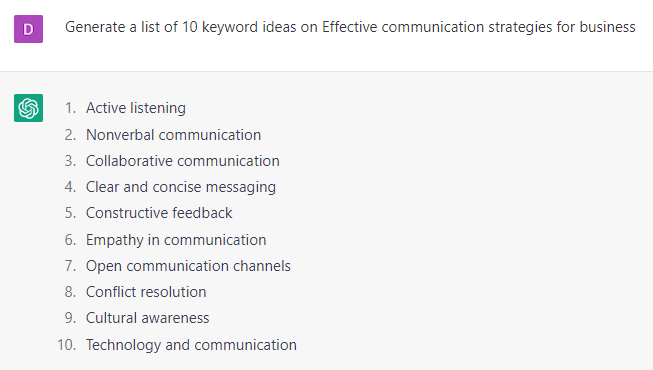

# Generating a List of Keywords

### FILL-IN-THE-BLANK **PROMPTS:**

```jsx
Generate a list of 10 keyword ideas on **[topic]**.

Optional: Only suggest keywords that have high volume and low to medium competition.

Optional: Cluster this list of keywords according to funnel stages whether they are top of the funnel, middle of the funnel or bottom of the funnel keywords (based on previous search).
```

```jsx
Provide a list of top 10 ranking blogs on the keyword **[keyword]**. **[Mention URL]**.
```

```jsx
Provide a list of relevant topics related to **[topic].**
```

```jsx
Provide 10 long tail keywords related to **[topic]**. Match each keyword with any of the 4 types of search intent.
```

### EXAMPLES**:**



