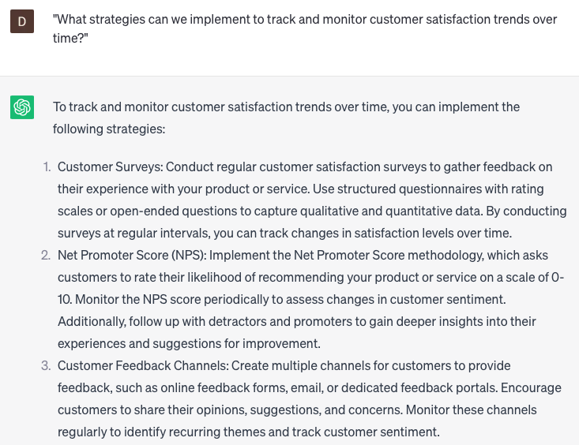

# Generating customer satisfaction reports

### FILL-IN-THE-BLANK **PROMPTS:**

```jsx
Could you create a report analyzing customer satisfaction regarding our **[product/service]**, utilizing the feedback we've gathered during the past **[time period]**? The report should encompass general satisfaction ratings, **[sentiment analysis/feedback categorization]**, **[quantitative data like response counts or customer ratings]**, and include customers' specific comments or suggestions pertaining to **[specific aspects of the product/service]**.
```

```jsx
We seek to gain deeper insights into our customers' perspectives regarding a particular aspect of our business and its competitive standing within the **[market/geographical location]**. Can you utilize our customer feedback data to create a comprehensive report assessing their satisfaction levels in this specific area of our business? The report should encompass **[sentiment analysis/feedback categorization], [quantitative data like response counts or customer ratings], [specific customer segments or demographics]**, as well as highlight prevalent themes or concerns that emerged from their feedback.
```

```jsx
Could you provide us with a comprehensive customer satisfaction report, drawing a comparison between our **[product/service]** and our primary competitors in the **[market/geographical location]**? The report should incorporate a combination of quantitative and qualitative data, enabling us to gain a holistic understanding of our performance. Please include **[sentiment analysis/feedback categorization]**, evaluation of **[specific aspects of the product/service]**, analysis of **[specific customer segments or demographics]**, and identification of any opportunities or threats that arise from the data.
```

### QUESTIONS-BASED P**ROMPTS:**

1. "How can we effectively generate customer satisfaction reports to gauge the overall satisfaction levels of our customers?"
2. "What metrics and indicators should be included in our customer satisfaction reports to provide a comprehensive overview?"
3. "Are there any specific survey methodologies or feedback collection techniques we should employ to gather accurate data for our reports?"
4. "How can we analyze and interpret customer satisfaction data to extract meaningful insights and identify areas for improvement?"
5. "What measures should we take to ensure the reliability and validity of our customer satisfaction reports?"
6. "Are there any tools or software solutions that can assist in automating the generation of customer satisfaction reports?"
7. "How can we effectively present and communicate our customer satisfaction reports to stakeholders and decision-makers within the organization?"
8. "What strategies can we implement to track and monitor customer satisfaction trends over time?"
9. "How can we compare our customer satisfaction performance against industry benchmarks or competitors to gain valuable insights?"
10. "What steps should we take to take action based on the findings of our customer satisfaction reports and drive improvements in customer experience?"

### EXAMPLES:

