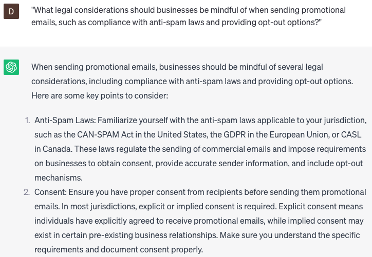

# Generating promotional emails

### FILL-IN-THE-BLANK **PROMPTS:**

```jsx
Could you furnish me with a collection of **[number]** distinct email subject lines that would effectively promote our **[product/service]** to the desired **[target audience]**?
```

```jsx
What are a few verified tactics to **[generate urgency/establish authority/build trust]** in our promotional emails concerning the **[upcoming event/limited-time offer]**?
```

```jsx
What approaches can we employ to customize our promotional emails for various segments of our audience, encompassing factors like **[age range/geographic location/interests]**, while guaranteeing the content remains pertinent and captivating?
```

### QUESTIONS-BASED P**ROMPTS:**

1. "What strategies can businesses employ to craft compelling subject lines that entice recipients to open their promotional emails?"
2. "How can businesses effectively personalize promotional emails to resonate with individual recipients and increase engagement?"
3. "What role does storytelling play in promotional emails, and how can businesses use narratives to capture the attention and interest of recipients?"
4. "How can businesses leverage customer segmentation and targeting to send tailored promotional emails that cater to specific preferences and needs?"
5. "What are some best practices for designing visually appealing promotional emails that align with the brand identity and enhance the overall user experience?"
6. "What techniques can businesses use to create a sense of urgency and drive immediate action in their promotional emails?"
7. "How can businesses optimize the length and structure of promotional emails to ensure key information is effectively communicated and retained by recipients?"
8. "What strategies can businesses employ to encourage recipients to share or forward promotional emails, expanding their reach and potential customer base?"
9. "How can businesses use A/B testing and data analytics to refine their promotional emails and improve their conversion rates over time?"
10. "What legal considerations should businesses be mindful of when sending promotional emails, such as compliance with anti-spam laws and providing opt-out options?"

### EXAMPLES:

