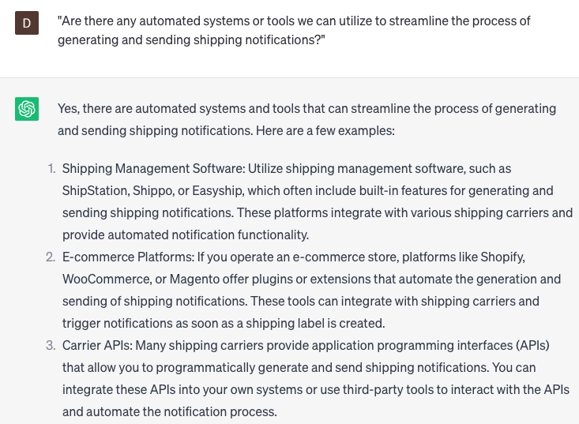

# Generating shipping notifications

### FILL-IN-THE-BLANK **PROMPTS:**

```jsx
I require your assistance in crafting a shipping notification for order **[order number]**, which was placed by **[customer name]** on **[date]**. The package is estimated to reach **[destination]** on **[delivery date]**, and I would like to promptly inform the customer about the upcoming delivery. Please ensure that the notification includes the tracking number and any other pertinent details.
```

```jsx
I require your assistance in composing a shipping notification to be sent to a group of customers who have pre-ordered our latest product. I would appreciate your help in crafting a message that incorporates **[the estimated delivery date/comprehensive product details/any additional pertinent information].**
```

```jsx
I require your assistance in generating a shipping notification that encompasses a personalized message for each individual customer. Could you please help me create a message that includes tailored product recommendations based on their **[purchase history/order details/delivery information]**?
```

### QUESTIONS-BASED P**ROMPTS:**

1. "How can we generate informative and timely shipping notifications to keep customers updated on the status of their shipments?"
2. "What information should be included in our shipping notifications to provide customers with comprehensive tracking details?"
3. "Are there any specific templates or formats we should follow to maintain consistency in our shipping notification communications?"
4. "How can we ensure prompt delivery of shipping notifications to customers to provide real-time updates on their shipments?"
5. "What measures can we take to personalize shipping notifications and make them more engaging for customers?"
6. "Are there any automated systems or tools we can utilize to streamline the process of generating and sending shipping notifications?"
7. "How can we address any potential concerns or questions that customers may have in our shipping notification communications?"
8. "What steps should we take to ensure the security and privacy of customer information during the shipping notification process?"
9. "How can we gather feedback from customers regarding their shipping experience to identify areas for improvement in our shipping notification process?"
10. "What strategies should we implement to improve the overall efficiency and accuracy of generating shipping notifications?"

### EXAMPLES:

