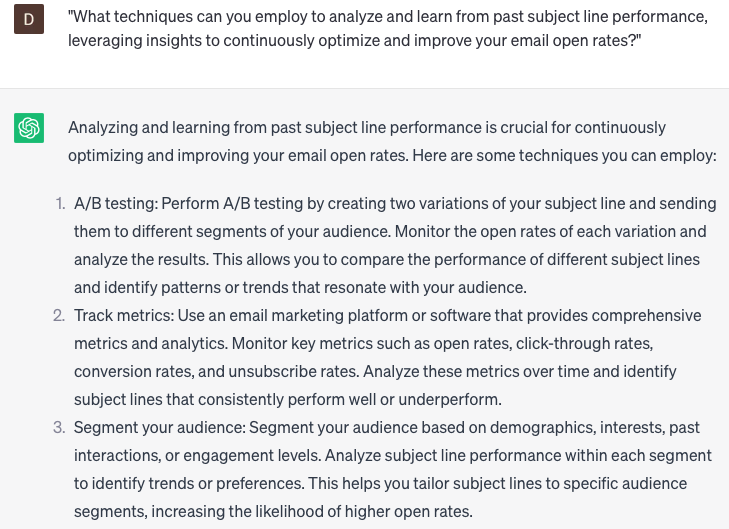

# Generating subject lines for emails

### FILL-IN-THE-BLANK **PROMPTS:**

```jsx
Could you provide a subject line suggestion for an email that promotes **[product/service]** to **[target audience]**?
```

```jsx
To capture recipients' attention and improve email open rates, we want to focus on crafting compelling subject lines that pique curiosity or offer value. How can we incorporate **[personalization/urgency/curiosity]** into our subject lines to entice readers? Consider A/B testing different **[wording/phrases/lengths]** to identify the most effective subject lines for our **[target audience]**.
```

```jsx
When generating subject lines for emails, how can we communicate the **[benefits/key message]** of our email concisely? Consider using **[action-oriented verbs/numbers/emotional triggers]** to create subject lines that resonate with our **[target audience]** and encourage them to open and engage with our emails.
```

### QUESTIONS-BASED P**ROMPTS:**

1. "How can you create an irresistible subject line that compels the recipient to stop scrolling, piques their curiosity, and motivates them to open your email?”
2. "What strategies can you employ to personalize your subject lines with the recipient's name or other relevant information, increasing the chances of engagement?"
3. "How do you create a sense of urgency or exclusivity in your subject lines to prompt immediate action from the recipient?"
4. "What techniques can you use to incorporate curiosity or intrigue into your subject lines, compelling recipients to click and explore further?"
5. "How can you leverage the power of social proof or testimonials in your subject lines to build credibility and trust with the recipient?"
6. "What methods can you employ to keep your subject lines concise and to the point, conveying the main message and value proposition effectively?"
7. "How do you avoid using spam trigger words or phrases in your subject lines, ensuring your emails land in the recipient's inbox rather than the spam folder?"
8. "What strategies can you use to A/B test different subject line variations to identify the most effective approach for your target audience?"
9. "How can you align your subject line with the content or offer inside the email, creating a cohesive and relevant experience for the recipient?"
10. "What techniques can you employ to analyze and learn from past subject line performance, leveraging insights to continuously optimize and improve your email open rates?"

### EXAMPLES:

