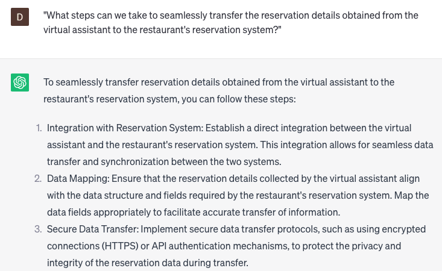

# Handling virtual assistant inquiries for restaurant reservations

### FILL-IN-THE-BLANK **PROMPTS:**

```jsx
I am currently facing challenges in **[managing/responding to/processing]** virtual assistant inquiries related to **[restaurant reservations/dining bookings]**. Could ChatGPT offer any **[solutions/tips/guidance]** to help **[improve/optimize/streamline]** the **[reservation process/customer experience]**?
```

```jsx
In what ways can ChatGPT be utilized to **[assist/automate/improve]** our **[virtual assistant/digital] [reservation system/booking platform]**, enabling it to **[better/faster/more accurately]** handle **[customer inquiries/booking requests]** for **[restaurant reservations/dining arrangements]**?
```

```jsx
As a **[restaurant staff/team member/booking agent]**, I hold the responsibility of **[handling/responding to/managing]** virtual assistant inquiries regarding **[reservations/booking]**. I aim to **[improve/optimize/streamline]** the **[reservation process/customer experience]**. How can ChatGPT **[help/support/assist]** me in **[this/task/challenge]**, and what **[tools/features/functions]** does it **[offer/provide/have]** specifically for **[virtual assistant inquiries/restaurant reservations]**?
```

### QUESTIONS-BASED P**ROMPTS:**

1. "How can we handle virtual assistant inquiries effectively to assist customers in making restaurant reservations?"
2. "What strategies can we employ to train the virtual assistant in understanding and addressing various inquiries related to restaurant reservations?"
3. "Are there any specific reservation management systems or APIs we should integrate with the virtual assistant to streamline the reservation process?"
4. "How can we ensure that the virtual assistant provides accurate and up-to-date information on restaurant availability, timings, and reservation policies?"
5. "What measures should we take to personalize the virtual assistant responses based on the customer's preferences, such as cuisine type or location?"
6. "How can we provide additional details or recommendations within the virtual assistant responses to help customers in choosing suitable restaurants for their reservations?"
7. "Are there any legal or privacy considerations we should keep in mind when handling virtual assistant inquiries for restaurant reservations?"
8. "What steps can we take to seamlessly transfer the reservation details obtained from the virtual assistant to the restaurant's reservation system?"
9. "How can we handle changes or cancellations to existing reservations through the virtual assistant while ensuring accurate and efficient updates?"
10. "What strategies should we implement to gather feedback from customers regarding their experience with the virtual assistant for restaurant reservations and identify areas for improvement?"

### EXAMPLES:

