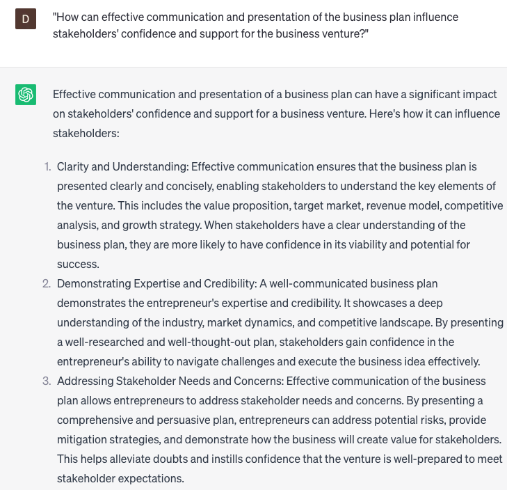

# Help with business planning

### FILL-IN-THE-BLANK **PROMPTS:**

```jsx
Could you furnish me with a detailed analysis of the market trends within the **[industry]** sector over the next **[number]** years? Please incorporate potential opportunities and risks that a **[type of business]** company should take into account.
```

```jsx
I need assistance with developing a comprehensive business plan for my self-employment venture. Can you guide me through the process of **[defining my target market/analyzing competitors/establishing pricing strategies]** and creating a roadmap for **[marketing/sales/financial projections]**?
```

```jsx
Considering the present market trends and competitive landscape, could you propose any novel products or services that **[business type]** could introduce to address the evolving market demands? Include details regarding pricing, target audience, and marketing strategies.
```

### QUESTIONS-BASED P**ROMPTS:**

1. "Why is business planning considered a crucial foundation for success, as it provides a roadmap for achieving goals?"
2. "How does thorough market research and analysis contribute to effective business planning and decision-making?"
3. "What role does strategic goal-setting play in business planning, as it helps align efforts and resources towards a common vision?"
4. "Why is it important to develop a comprehensive financial plan as part of the business planning process?"
5. "In what ways can a well-crafted business plan attract investors, lenders, and strategic partners to support business growth?"
6. "How does a business plan help entrepreneurs identify and mitigate potential risks and challenges in their business ventures?"
7. "Why is it essential to regularly review and update the business plan to adapt to changing market dynamics and evolving customer needs?"
8. "What impact can a strong marketing and sales strategy have on achieving business objectives outlined in the business plan?"
9. "Why is it valuable to include a contingency plan in the business planning process to prepare for unexpected events or disruptions?"
10. "How can effective communication and presentation of the business plan influence stakeholders' confidence and support for the business venture?"

### EXAMPLES:

