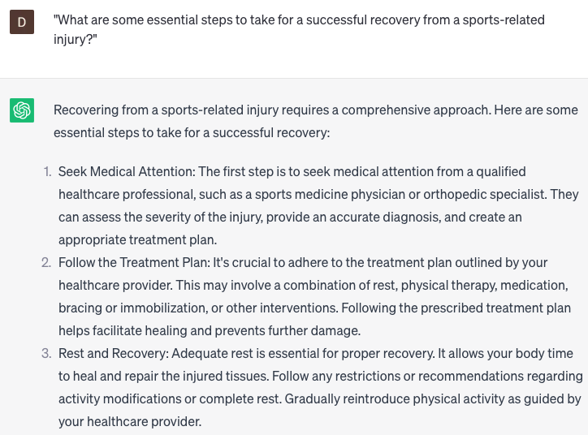

# Help with injury rehab

### FILL-IN-THE-BLANK **PROMPTS:**

```jsx
Could you develop a customized rehabilitation plan for my **[injury]**, taking into consideration my **[fitness level]** and **[rehabilitation goals]**? I'm seeking exercises and activities that promote recovery and help prevent future injuries.
```

```jsx
After my injury, I'm encountering **[symptoms]**. What measures can I take to manage them effectively? Are there any recommended exercises or stretches that could alleviate my **[pain/discomfort]**?
```

```jsx
What are some approaches I can adopt to **[prevent/further prevent]** potential injuries in the future? Are there any particular stretches or exercises that can aid in injury **[prevention/recovery]**?
```

### QUESTIONS-BASED P**ROMPTS:**

1. "How can I manage pain during my injury rehabilitation process?"
2. "What are the key factors to consider when designing a personalized rehab program?"
3. "What are some common mistakes to avoid during injury rehabilitation?"
4. "How can I maintain motivation and stay consistent with my rehab exercises?"
5. "What are the best strategies for preventing re-injury after completing a rehab program?"
6. "What are some alternative therapies or treatments that can complement traditional injury rehab methods?"
7. "How long does it typically take to recover from a specific injury, and what factors can influence the timeline?"
8. "What are the recommended steps for safely returning to physical activity after completing injury rehab?"
9. "How can I effectively communicate with my healthcare provider to ensure a successful rehab journey?"
10. "What are some essential steps to take for a successful recovery from a sports-related injury?"

### EXAMPLES:

