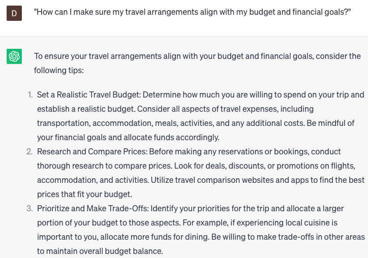

# Making travel arrangements

### FILL-IN-THE-BLANK **PROMPTS:**

```jsx
I need assistance in arranging transportation from **[departure city]** to **[destination city]** on **[date]**. I would prefer to arrive **[time of day]** and have **[number]** bags to check in. Here are my travel details: **[client's travel details]**.
```

```jsx
For my upcoming trip to **[destination city]**, I require assistance with hotel reservations. Would you be able to provide me with **[number] recommendations for [hotel type]** options in the **[neighborhood]** area that offer **[amenity]**?
```

```jsx
I have a business trip coming up, and I'm in need of reliable transportation from the airport to my hotel. Could you assist me in finding a reputable **[type of transport]** service that operates in **[city]** and accepts **[payment method]**?
```

### QUESTIONS-BASED P**ROMPTS:**

1. "What are the essential documents and identification I need to prepare before making travel arrangements?"
2. "How can I find the best deals on flights and accommodations for my upcoming trip?"
3. "What are some reliable websites or platforms I can use to book my travel arrangements?"
4. "What factors should I consider when choosing a hotel or accommodation for my trip?"
5. "What are some common transportation options available for exploring the destination once I arrive?"
6. "Are there any visa requirements or restrictions I should be aware of when planning my travel arrangements?"
7. "What are some important safety considerations I should keep in mind while making travel arrangements?"
8. "How can I make sure my travel arrangements align with my budget and financial goals?"
9. "What are some effective strategies for managing time zones and jet lag during travel?"
10. "Are there any specific cultural norms or customs I should be aware of when making travel arrangements for certain destinations?"

### EXAMPLES:

