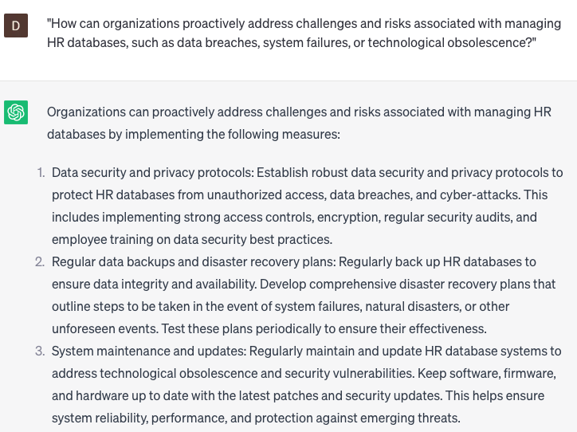

# Managing HR databases

### FILL-IN-THE-BLANK **PROMPTS:**

```jsx
Could you assist me in crafting a detailed job description for a **[position]** role within the **[department]** department? The job description should encompass essential **[skill/qualification]** requirements, key **[responsibility/task]** areas, and also highlight the company's **[mission/values/culture].**
```

```jsx
What are the **[number]** essential skills that are crucial for employees in **[department]** to possess in order to contribute to the achievement of **[company objective/goal]**? Additionally, how can we effectively assess these skills during the **[hiring/promotion/performance evaluation]** process?
```

```jsx
What strategies can we employ to develop and implement **[training/workshop/onboarding]** programs aimed at enhancing **[skill/competency]** among employees in **[department]**? Furthermore, which metrics can we utilize to monitor and measure their progress and the success of these programs?
```

### QUESTIONS-BASED P**ROMPTS:**

1. "Why is effective management of HR databases crucial for ensuring accurate and reliable employee data, supporting strategic HR decision-making?"
2. "What key considerations should be taken into account when selecting and implementing HR databases to meet the specific needs of the organization?"
3. "How can HR databases be organized and structured to optimize data storage, retrieval, and analysis for various HR functions?"
4. "In what ways can HR databases ensure data integrity and security, safeguarding sensitive employee information and complying with privacy regulations?"
5. "What strategies can be employed to maintain data accuracy and consistency within HR databases, including regular data audits and updates?"
6. "How can HR databases facilitate efficient reporting and analysis of HR metrics, enabling evidence-based insights and monitoring of key HR indicators?"
7. "What measures should be taken to ensure proper data governance, including data quality controls, access restrictions, and data retention policies?"
8. "How can HR databases support effective talent management, such as succession planning, performance evaluations, and learning and development initiatives?"
9. "What role can integration and interoperability of HR databases play in streamlining HR processes, minimizing data duplication, and enhancing data sharing across systems?"
10. "How can organizations proactively address challenges and risks associated with managing HR databases, such as data breaches, system failures, or technological obsolescence?"

### EXAMPLES:

