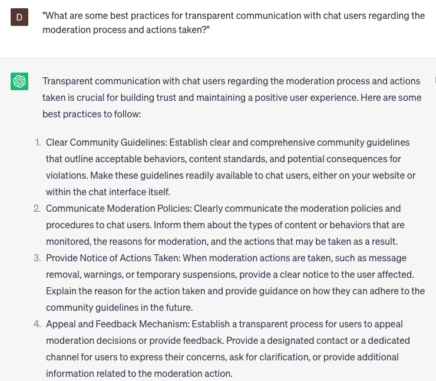

# Moderating inappropriate chat messages

### FILL-IN-THE-BLANK **PROMPTS:**

```jsx
What strategies can be employed to **[train/optimize]** ChatGPT for the purpose of **[context and sarcasm recognition/false positive avoidance]** in chat messages, with the ultimate goal of **[reducing/minimizing] [mistakes/false flags/over-moderation]**?
```

```jsx
Could you conduct an **[analysis/review]** of the chat logs from the previous **[week/month/year]** and **[identify/highlight/flag]** any messages that might necessitate additional examination, possess the potential for inappropriateness, or contain offensive language?
```

```jsx
By examining the chat history of a particular **[user/group/channel]**, can you ascertain whether their conduct has remained consistently **[appropriate/inappropriate]** or if they have **[recently begun employing problematic language/demonstrated concerning language over a period of time]**?
```

### QUESTIONS-BASED P**ROMPTS:**

1. "What strategies can be employed to effectively identify and moderate inappropriate chat messages in real-time?"
2. "How can you strike a balance between preserving freedom of expression and maintaining a safe and respectful chat environment?"
3. "In what ways can automated filters and content moderation tools assist in detecting and flagging inappropriate chat messages?"
4. "What measures can be taken to establish clear community guidelines and rules for chat interactions to prevent inappropriate content?"
5. "How can you train chat moderators to handle sensitive and potentially offensive chat messages with professionalism and empathy?"
6. "What role does user reporting and feedback play in identifying and addressing inappropriate chat messages?"
7. "How can you leverage machine learning algorithms to continuously improve the accuracy and effectiveness of chat message moderation?"
8. "What are the legal and ethical considerations to be mindful of when moderating chat messages?"
9. "How can you foster a supportive and inclusive chat community by proactively addressing and discouraging inappropriate chat behavior?"
10. "What are some best practices for transparent communication with chat users regarding the moderation process and actions taken?"

### EXAMPLES:

