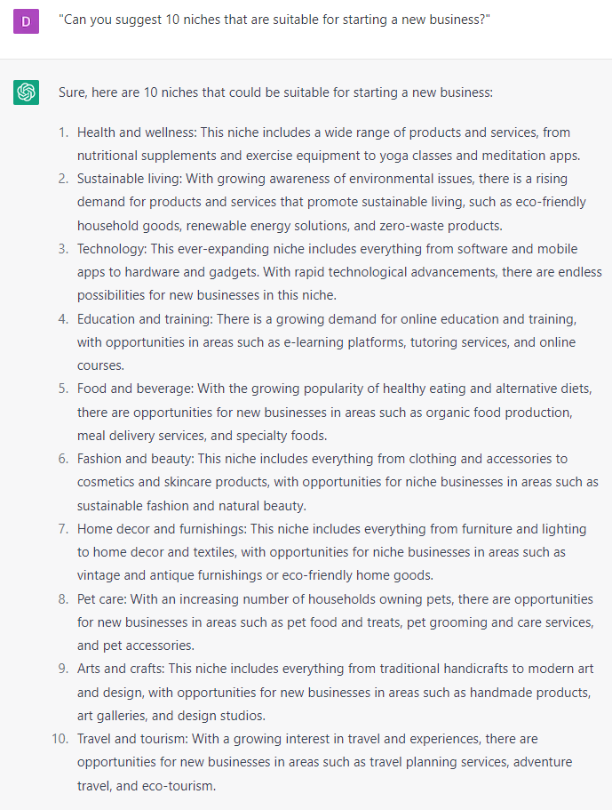

# Picking a Niche

### FILL-IN-THE-BLANK **PROMPTS:**

```jsx
List 3 potential niches interested in buying **[product].**
```

```jsx
Tell me the growing niches for **[business type].**
```

```jsx
I want to sell **[product]**. It helps **[describe what it goes]**. Brainstorm 10 possible markets that would require this solution.
```

### QUESTION-BASED **PROMPTS:**

1. "Can you suggest 10 niches that are suitable for starting a new business?"
2. "What are the top 10 growing niches for entrepreneurs in 2023?"
3. "I'm looking to start a new business, what are the most promising niches right now?"
4. "Can you help me find 10 profitable niches to start a new business in?"
5. "I'm looking to get into a new market, what are the top 10 niches to consider?"
6. "What are the 10 most untapped niches for starting a new business in 2023?"
7. "Can you provide me with a list of 10 niche ideas for a new business opportunity?"
8. "What are the 10 hottest niches for starting a new business in the next 5 years?"
9. "I'm in the early stages of starting a new business, what are 10 niches that are currently growing?"
10. "Can you give me 10 niche ideas for starting a new business that have potential for high growth?"
11. “What could be 3 potential niches for selling a skincare product?”
12. “What are growing niches for online coaches?”

### EXAMPLES:

