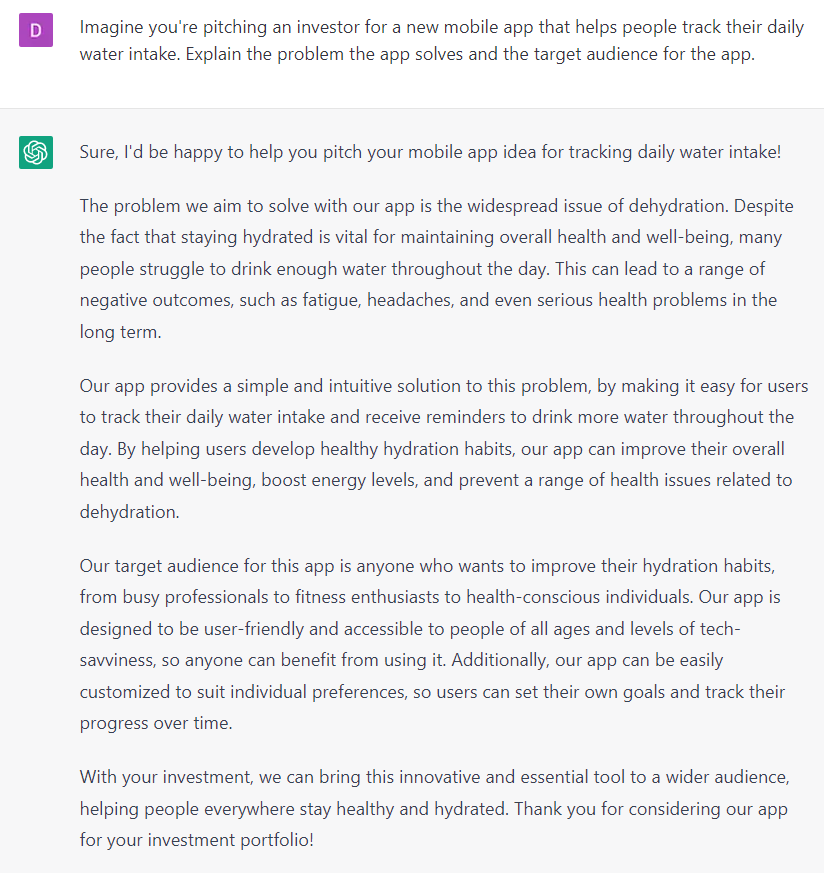

# Preparing to Pitch Investors

You can use ChatGPT to role-play situations and perfect your pitch. Here are 10 examples of how you can write scenario prompts and request feedback on your pitch.

### SCENARIO **PROMPTS:**

1. Imagine you're pitching an investor for a new mobile app that helps people track their daily water intake. Explain the problem the app solves and the target audience for the app.
2. You're pitching an investor for a new eco-friendly fashion line. Describe the unique features of the clothing and how they benefit the environment, and share your plans for marketing and distribution.
3. Imagine you're pitching an investor for a new software platform that automates the accounts payable process for small businesses. Explain the pain points that the software solves and how it saves time and money for business owners.
4. You're pitching an investor for a new plant-based meat alternative. Describe the product's nutritional benefits and how it compares to traditional meat in taste and texture, and share your plans for production and distribution.
5. Imagine you're pitching an investor for a new telemedicine platform that connects patients with healthcare providers through video chat. Describe the problem the platform solves and how it benefits patients and providers, and share your plans for marketing and scaling the platform.
6. You're pitching an investor for a new service that helps people find affordable housing in high-cost cities. Explain the problem the service solves and the target audience for the service, and share your plans for revenue and growth.
7. Imagine you're pitching an investor for a new social media platform that prioritizes user privacy and data security. Describe the features of the platform that set it apart from other social media platforms, and share your plans for user acquisition and monetization.
8. You're pitching an investor for a new e-commerce platform that connects consumers with local artisans and craftspeople. Explain the problem the platform solves and how it benefits both consumers and artisans, and share your plans for marketing and expansion.
9. Imagine you're pitching an investor for a new online marketplace for sustainable and ethical consumer goods. Describe the unique features of the marketplace and how it benefits both consumers and producers, and share your plans for growth and impact.
10. You're pitching an investor for a new blockchain-based platform that helps small businesses access financing from a global network of investors. Explain the problem the platform solves and how it benefits small businesses and investors, and share your plans for scaling the platform.

### EXAMPLES:

