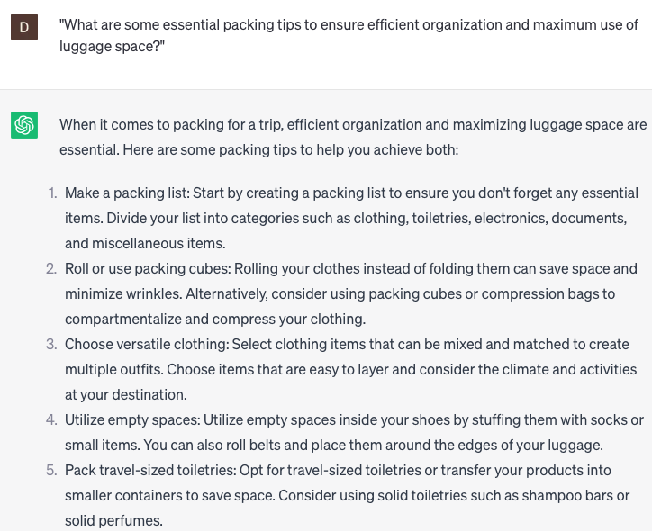

# Provide packing tips

### FILL-IN-THE-BLANK **PROMPTS:**

```jsx
I have plans to relocate to **[city]** in the coming month and could use some guidance on efficient packing techniques. Could you offer suggestions on how to pack specific items, such as **[mention specific items]**?
```

```jsx
When it comes to providing packing tips, what essential strategies and suggestions can you offer to **[help travelers pack efficiently/maximize luggage space/avoid overpacking]**?
```

```jsx
I'm preparing for an upcoming business trip and would appreciate some advice on packing my **[specific items]** in a professional and efficient manner. Could you provide recommendations on what to bring and share tips on effective packing techniques?
```

### QUESTIONS-BASED P**ROMPTS:**

1. "What are some essential packing tips to ensure efficient organization and maximum use of luggage space?"
2. "Can you suggest versatile clothing items or accessories that can be mixed and matched for different outfits while traveling?"
3. "What are some practical strategies for packing toiletries and liquids to comply with airport security regulations?"
4. "Are there any innovative packing techniques or hacks that can help prevent wrinkles and keep clothes organized during transit?"
5. "Can you recommend lightweight and compact travel gear or accessories that are essential for a comfortable and hassle-free trip?"
6. "What are some space-saving options for packing shoes efficiently and protecting them from damaging other items in the luggage?"
7. "Are there any useful gadgets or tools that can assist with packing, such as compression bags, packing cubes, or travel-sized containers?"
8. "Can you provide tips for packing electronics and chargers to keep them organized and protected during travel?"
9. "What are some considerations for packing medication, first aid supplies, and other essential health-related items for a trip?"
10. "How can travelers pack for different weather conditions or activities, ensuring they have appropriate clothing and gear for each situation?"

### EXAMPLES:

