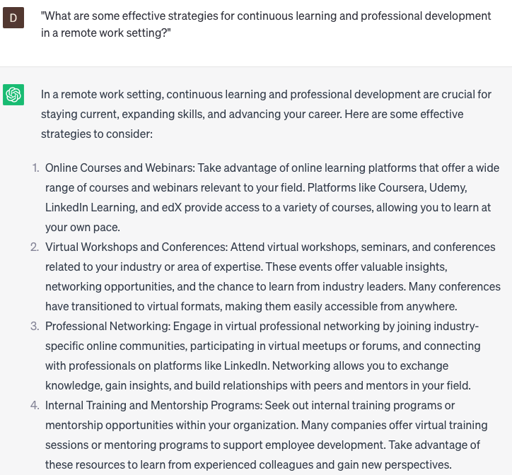

# Provide remote work advice

### FILL-IN-THE-BLANK **PROMPTS:**

```jsx
What are a few impactful methods for enhancing **[productivity/communication/collaboration]** among team members who are **[remote/online/offsite]** at **[company name]**?
```

```jsx
What are some recommended approaches for effectively **[managing/leading/engaging]** a **[remote/online/offsite]** team at **[company name]**?
```

```jsx
Could you offer me some valuable insights on ways to **[increase/improve/enhance] [efficiency/productivity/teamwork]** while operating remotely at **[company name]**?
```

### QUESTIONS-BASED P**ROMPTS:**

1. "What advice or strategies can you offer for maintaining focus and productivity in a remote work environment?"
2. "How can individuals effectively manage their time and establish a routine that supports a healthy work-life balance in remote work?"
3. "What are some effective communication practices and tools that can facilitate collaboration and teamwork in remote work setups?"
4. "In what ways can individuals overcome the challenges of remote work and stay motivated and engaged?"
5. "What strategies can individuals implement to create boundaries between work and personal life when working remotely?"
6. "How can individuals combat feelings of isolation or loneliness in remote work settings?"
7. "What are some strategies for managing distractions and maintaining focus in a home office environment?"
8. "What advice can you offer for building and nurturing professional relationships remotely?"
9. "How can individuals prioritize self-care and well-being while working remotely?"
10. "What are some effective strategies for continuous learning and professional development in a remote work setting?"

### EXAMPLES:

