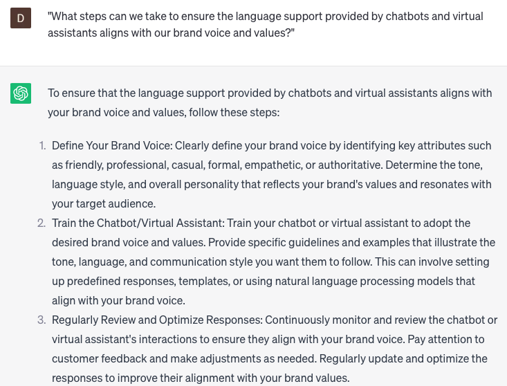

# Providing chatbot and VA training for language support

### FILL-IN-THE-BLANK **PROMPTS:**

```jsx
What are some highly effective **[adjective]** approaches and **[noun]** that can be utilized to deliver thorough training for **[type of chatbot or virtual assistant]**, enabling them to effectively assist **[language]**-speaking customers? Additionally, how can I ensure that my training program is **[adjective]** and aligns with the **[noun]** of our company?
```

```jsx
What strategies can I apply to enhance the **[adjective]** performance of **[type of chatbot or virtual assistant]** when engaging with **[language]**-speaking customers, and how can I adapt the **[noun]** of my training program to effectively incorporate these improvements?
```

```jsx
What measures should I take to ensure that my **[adjective]** training program for **[type of chatbot or virtual assistant]** language support remains **[verb]** and **[adjective]** as time progresses? Additionally, what steps should I follow to **[verb]** employee **[noun]** and **[noun]** throughout the training process?
```

### QUESTIONS-BASED P**ROMPTS:**

1. "How can we provide effective training for chatbots and virtual assistants to ensure accurate and reliable language support?"
2. "What strategies can we employ to train chatbots and virtual assistants in understanding and responding to various language nuances and contexts?"
3. "Are there any specific techniques or approaches we should use to train chatbots and virtual assistants to handle complex language queries?"
4. "How can we continuously update and refine the training data and algorithms for chatbots and virtual assistants to improve their language support capabilities?"
5. "What measures should we take to monitor and evaluate the performance of chatbots and virtual assistants in delivering language support?"
6. "How can we provide ongoing feedback and coaching to chatbots and virtual assistants to enhance their language understanding and response accuracy?"
7. "Are there any industry-specific terminologies or jargon that we should incorporate into the training of chatbots and virtual assistants for language support?"
8. "What steps can we take to ensure the language support provided by chatbots and virtual assistants aligns with our brand voice and values?"
9. "How can we train chatbots and virtual assistants to escalate complex language inquiries to human agents for further assistance?"
10. "What strategies should we implement to keep chatbots and virtual assistants updated with the latest language trends and changes?"

### EXAMPLES:

