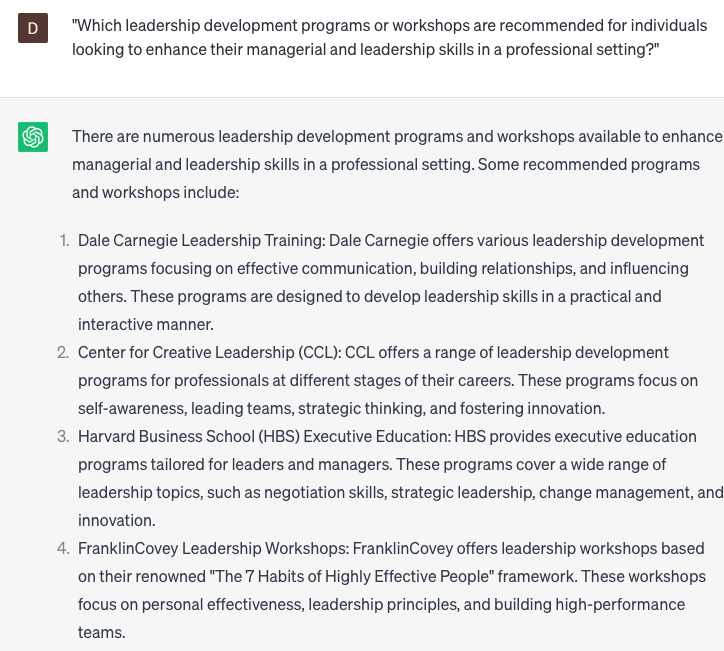

# Recommend educational programs

### FILL-IN-THE-BLANK **PROMPTS:**

```jsx
What are some highly recommended educational programs in **[field of interest]** suitable for **[level of education]** students at **[institution/organization]** who aspire to **[learning objective]**?
```

```jsx
In my pursuit of **[career objective]**, I'm interested in exploring unconventional paths and non-traditional educational programs. Drawing inspiration from the concept of "unbundling education" discussed in the book "The End of College: Creating the Future of Learning and the University of Everywhere" by Kevin Carey, could you recommend alternative educational programs or platforms that can help me achieve my career objective while offering flexibility and specialized skill development?
```

```jsx
What are some educational programs that can assist me in achieving my career objective of **[career objective]**?
```

### QUESTIONS-BASED P**ROMPTS:**

1. "What educational programs or courses are available that can help individuals develop the skills and knowledge needed for a specific career path?"
2. "How can professional development programs contribute to advancing educators' pedagogical techniques and classroom management skills?"
3. "What are some reputable online learning platforms that offer a wide range of educational programs catering to different interests and learning levels?"
4. "What vocational training programs are recommended for individuals seeking hands-on experience and specialized skills in a particular trade or industry?"
5. "Which summer enrichment programs provide engaging and immersive learning experiences for students interested in exploring various subjects beyond the traditional curriculum?"
6. "What are some international exchange or study abroad programs that offer cultural immersion and global learning opportunities for students?"
7. "Which STEM-focused educational programs are highly regarded for promoting scientific inquiry, problem-solving skills, and innovation among students?"
8. "What are some entrepreneurship and business development programs that provide aspiring entrepreneurs with the necessary tools and resources to launch and grow their ventures?"
9. "Which leadership development programs or workshops are recommended for individuals looking to enhance their managerial and leadership skills in a professional setting?"
10. "What are some community-based educational programs that offer support and resources for learners from disadvantaged backgrounds, promoting educational equity and empowerment?"

### EXAMPLES:

