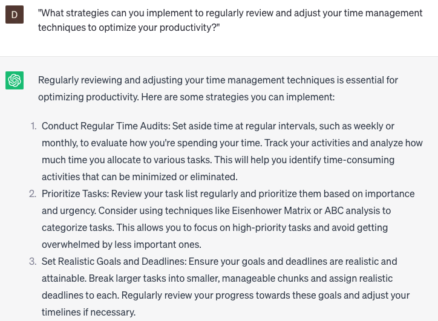

# Research time management

### FILL-IN-THE-BLANK **PROMPTS:**

```jsx
What are some efficient time management strategies that professionals in **[your role/industry]** can utilize?
```

```jsx
We want to delve deeper into effective time management techniques to boost our productivity. Can you conduct research on **[time management methods/productivity frameworks]** and provide insights on their benefits and practical implementation?
```

```jsx
What are some recommended time management strategies specific to **[your industry/role]**, and how can they be effectively implemented?
```

### QUESTIONS-BASED P**ROMPTS:**

1. "How can you effectively prioritize tasks and manage your time to ensure that you're focusing on what truly matters?"
2. "What are some practical techniques for overcoming procrastination and staying on track with your time management goals?"
3. "How can you strike a balance between being productive and avoiding burnout in your daily schedule?"
4. "What strategies can you employ to optimize your time by batching similar tasks or activities together?"
5. "How can you leverage the power of time-blocking and scheduling to increase productivity and manage your commitments?"
6. "What are some tips for effectively setting deadlines and holding yourself accountable to meet them?"
7. "How can you minimize distractions and create a focused work environment to make the most of your time?"
8. "What are some effective methods for delegating tasks and leveraging the strengths of others to save time and increase efficiency?"
9. "How can you cultivate the habit of saying 'no' to nonessential tasks or commitments to protect your time and priorities?"
10. "What strategies can you implement to regularly review and adjust your time management techniques to optimize your productivity?"

### EXAMPLES:

