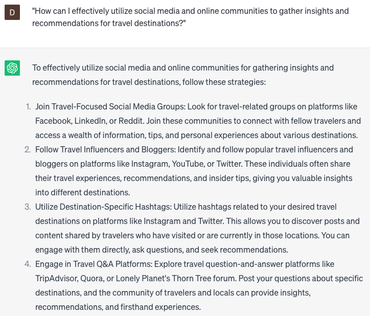

# Researching travel destinations

### FILL-IN-THE-BLANK **PROMPTS:**

```jsx
Could you suggest **[number]** captivating travel destinations in **[country]** known for their **[adjective]** qualities, ideal for **[activity]**?
```

```jsx
What are the **[adjective] [country]** destinations that rank among the top **[number]** choices for travel during **[season]**?
```

```jsx
I need assistance in designing a **[number]**-day itinerary for my trip to **[city]**. Could you provide recommendations for **[adjective]** attractions, **[adjective]** restaurants, and **[adjective]** activities to include in my plan?
```

### QUESTIONS-BASED P**ROMPTS:**

1. "How can I discover off-the-beaten-path travel destinations that offer unique cultural experiences?"
2. "What are some essential resources or websites for researching and planning a memorable vacation?"
3. "Can you suggest strategies for finding budget-friendly travel destinations without compromising on the experience?"
4. "What are some lesser-known destinations that offer breathtaking natural landscapes and outdoor activities?"
5. "How can I find travel destinations that cater to specific interests, such as food, history, or adventure?"
6. "Are there any tips for researching the safety and security of potential travel destinations?"
7. "What are some reliable sources for gathering authentic and unbiased reviews about various travel destinations?"
8. "Can you recommend strategies for uncovering hidden gems and local favorites in popular tourist destinations?"
9. "What factors should I consider when researching travel destinations based on the best time to visit?"
10. "How can I effectively utilize social media and online communities to gather insights and recommendations for travel destinations?"

### EXAMPLES:

