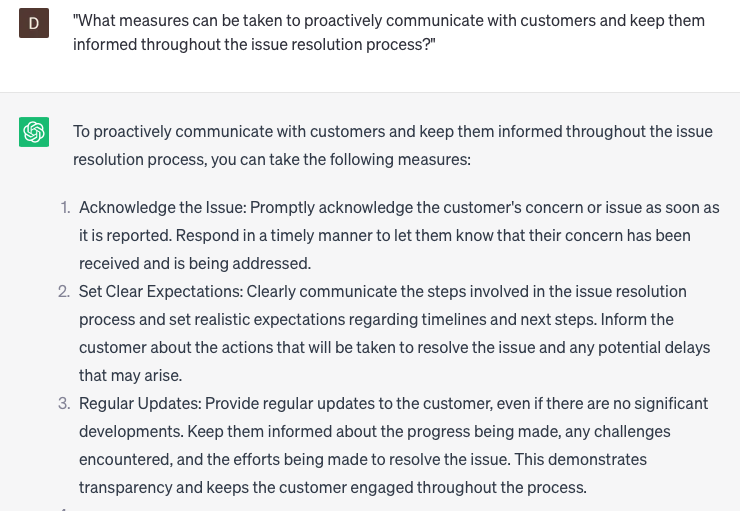

# Resolving customer issues efficiently

### FILL-IN-THE-BLANK **PROMPTS:**

```jsx
Which **[specific actions/strategies/tactics]** can I implement in order to address **[customer issue]** pertaining to **[specific product/service/feature]** in a **[efficient/quick]** manner?
```

```jsx
What approaches can I adopt to provide tailored solutions to address **[customer name]**'s **[specific issue]**?
```

```jsx
To gain a better understanding and address the **[customer issue]** related to **[specific concern/question]**, could you please provide me with additional information about **[product/service/feature]**?
```

### QUESTIONS-BASED P**ROMPTS:**

1. "What strategies can be implemented to ensure efficient resolution of customer issues through chat support?"
2. "How can you prioritize and triage customer issues to expedite resolution times and minimize customer effort?"
3. "In what ways can chat agents be empowered with the necessary tools and resources to efficiently resolve customer issues?"
4. "What role does active listening and effective questioning techniques play in quickly identifying and understanding customer issues?"
5. "How can you leverage knowledge bases and FAQs to provide self-service options and expedite issue resolution?"
6. "What measures can be taken to proactively communicate with customers and keep them informed throughout the issue resolution process?"
7. "How can you efficiently escalate complex or unresolved issues to higher levels of support while minimizing customer inconvenience?"
8. "What are the best practices for documenting customer issues and resolutions to ensure consistency and facilitate future reference?"
9. "How can customer feedback and satisfaction surveys be utilized to continuously improve the efficiency of issue resolution in chat support?"
10. "What innovative approaches or technologies can enhance the efficiency and effectiveness of issue resolution through chat interactions?"

### EXAMPLES:

