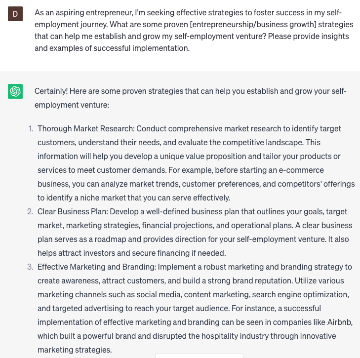

# Suggest entrepreneurship strategies

### FILL-IN-THE-BLANK **PROMPTS:**

```jsx
Could you provide insights into effective **[marketing strategies]** that can assist me in promoting my **[self-employment business]**?
```

```jsx
As an aspiring entrepreneur, I'm seeking effective strategies to foster success in my self-employment journey. What are some proven **[entrepreneurship/business growth]** strategies that can help me establish and grow my self-employment venture? Please provide insights and examples of successful implementation.
```

```jsx
Could you suggest **[growth strategies]** that can facilitate the expansion of my **[self-employment business]** operations?
```

### QUESTIONS-BASED P**ROMPTS:**

1. "What are some key entrepreneurship strategies that can help aspiring entrepreneurs turn their ideas into successful ventures?"
2. "How does a strong value proposition and differentiation strategy contribute to the competitive advantage of an entrepreneur's business?"
3. "What role does market research and analysis play in developing effective entrepreneurship strategies that resonate with target customers?"
4. "Why is it important for entrepreneurs to embrace a growth mindset and continuously seek opportunities for learning and improvement?"
5. "In what ways can strategic partnerships and collaborations enhance an entrepreneur's ability to scale and expand their business?"
6. "How does an effective marketing and branding strategy help entrepreneurs create awareness, attract customers, and build a loyal customer base?"
7. "Why is it essential for entrepreneurs to have a solid financial management strategy to ensure the sustainability and profitability of their ventures?"
8. "What impact can innovation and adaptation strategies have on the long-term success of entrepreneurs in a rapidly changing business landscape?"
9. "Why is it valuable for entrepreneurs to prioritize building a strong professional network and nurturing relationships with industry peers and mentors?"
10. "How can effective risk management and contingency planning strategies help entrepreneurs mitigate potential challenges and seize opportunities?"

### EXAMPLES:

