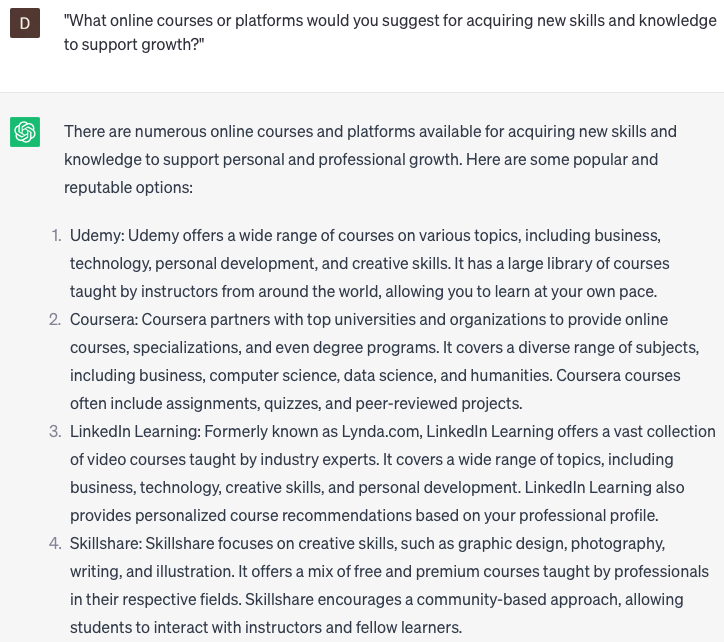

# Suggest growth resources

### FILL-IN-THE-BLANK **PROMPTS:**

```jsx
Could you suggest a **[resource type]** that would assist me in enhancing my **[skill/area of growth]**?
```

```jsx
For individuals at a **[beginner/intermediate/advanced]** level in **[skill/area of growth]**, which **[resource type]** would be most suitable?
```

```jsx
Can you suggest a **[resource type]** that can assist me in overcoming my **[specific challenge/weakness]** and enhancing my **[skill/area of growth]**?
```

### QUESTIONS-BASED P**ROMPTS:**

1. "What are some recommended books or ebooks that provide valuable insights and guidance for personal and professional growth?"
2. "Which podcasts or audio resources have been instrumental in inspiring individuals and fostering personal development?"
3. "What online courses or platforms would you suggest for acquiring new skills and knowledge to support growth?"
4. "Are there any influential TED Talks or motivational speeches that are highly regarded for igniting personal growth and mindset transformation?"
5. "Which social media influencers or thought leaders are considered valuable resources for continuous learning and personal growth?"
6. "What are some reputable websites or blogs that offer practical tips, strategies, and resources for personal and professional development?"
7. "Have you come across any insightful documentaries or films that provide valuable lessons and inspire personal growth?"
8. "What notable industry conferences or networking events are recommended for expanding knowledge and connecting with professionals in the field?"
9. "What mobile apps or digital tools have proven helpful in facilitating personal growth, productivity, or mindfulness?"
10. "Do you have any recommendations for mentorship programs or coaching services known for their positive impact on personal and professional development?"

### EXAMPLES:

