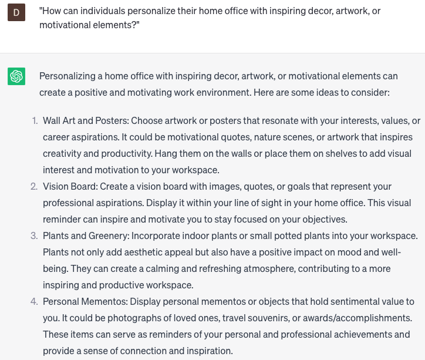

# Suggest home office setup

### FILL-IN-THE-BLANK **PROMPTS:**

```jsx
What are a few suggestions for creating a home office setup that optimizes productivity for **[role/department/team]** at **[company name]**?
```

```jsx
What steps can I take to optimize my home office arrangement in order to reduce distractions and enhance focus while working remotely as a **[job title/role]** at **[company name]**?
```

```jsx
What are the essential technology and equipment considerations when establishing a home office for **[specific work/project]** at **[company name]**?
```

### QUESTIONS-BASED P**ROMPTS:**

1. "What are some essential elements of an ergonomic home office setup that promote comfort and productivity?"
2. "How can the organization and arrangement of furniture, equipment, and lighting in a home office impact focus and efficiency?"
3. "What are some considerations for selecting a suitable chair and desk for a home office setup?"
4. "In what ways can the use of natural light and incorporating plants or greenery enhance the atmosphere and well-being in a home office?"
5. "What are the essential technology and connectivity requirements for an efficient home office?"
6. "How can individuals effectively manage and organize their digital files, documents, and work tools within a home office environment?"
7. "What are the considerations for establishing proper cable management and electrical setup in a home office?"
8. "How can individuals optimize their home office acoustics to minimize distractions and create a conducive work environment?"
9. "What are some creative storage solutions or space-saving ideas that can be implemented in a home office setup?"
10. "How can individuals personalize their home office with inspiring decor, artwork, or motivational elements?"

### EXAMPLES:

