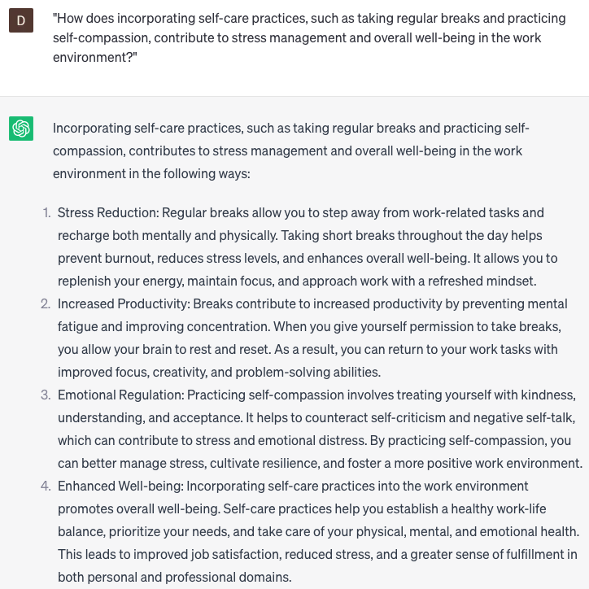

# Suggest stress-reducing techniques

### FILL-IN-THE-BLANK **PROMPTS:**

```jsx
What stress management techniques can be employed by employees in **[work area]** to mitigate stress during **[time period]**?
```

```jsx
For **[specific demographic]**, what are some effective self-care practices that can reduce stress and promote overall well-being?
```

```jsx
When faced with **[specific trigger]**, what strategies can be employed to effectively manage stress and anxiety?
```

### QUESTIONS-BASED P**ROMPTS:**

1. "How can incorporating mindfulness and meditation practices into your work routine help reduce stress and enhance focus?"
2. "What role does prioritization and effective time management play in managing work-related stress and increasing productivity?"
3. "In what ways can engaging in regular physical exercise or movement throughout the workday alleviate stress and improve overall well-being?"
4. "How can implementing relaxation techniques, such as deep breathing or progressive muscle relaxation, help you unwind and recharge during work breaks?"
5. "What benefits can be gained from establishing healthy boundaries and learning to say 'no' to excessive work demands?"
6. "How does seeking social support and fostering positive relationships with colleagues contribute to stress reduction in the workplace?"
7. "What strategies can individuals employ to effectively manage work-related pressures and avoid burnout?"
8. "How can engaging in creative outlets or hobbies outside of work serve as a stress-relieving activity and promote work-life balance?"
9. "What impact can adopting a positive mindset and practicing gratitude have on reducing stress and enhancing resilience in the workplace?"
10. "How does incorporating self-care practices, such as taking regular breaks and practicing self-compassion, contribute to stress management and overall well-being in the work environment?"

### EXAMPLES:

