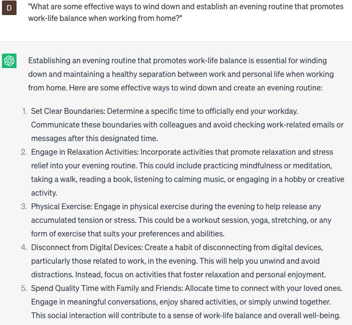

# Suggest work from home routines

### FILL-IN-THE-BLANK **PROMPTS:**

```jsx
What would be an optimal work-from-home routine for a **[job title]** with a **[hours]** work schedule, aiming to maximize their productivity?
```

```jsx
Could you propose a work-from-home routine that encourages healthy habits, includes physical activity, and suits a **[job title]** who works extended hours?
```

```jsx
What are a few strategies for **[company name]** employees to maintain motivation and prevent burnout while working remotely?
```

### QUESTIONS-BASED P**ROMPTS:**

1. "What are some effective work-from-home routines that can help establish structure and optimize productivity?"
2. "How can individuals establish a morning routine that sets a positive tone for the day when working from home?"
3. "What are some strategies for incorporating regular breaks and maintaining energy levels throughout the work-from-home day?"
4. "In what ways can individuals establish boundaries between work and personal life in a work-from-home routine?"
5. "How can individuals incorporate exercise or physical activity into their work-from-home routine?"
6. "What are some effective techniques for managing time and prioritizing tasks in a work-from-home routine?"
7. "How can individuals create a dedicated workspace that enhances focus and productivity in their work-from-home routine?"
8. "What strategies can individuals use to manage distractions and maintain concentration during their work-from-home routine?"
9. "How can individuals incorporate moments of relaxation and self-care into their work-from-home routine?"
10. "What are some effective ways to wind down and establish an evening routine that promotes work-life balance when working from home?"

### EXAMPLES:

