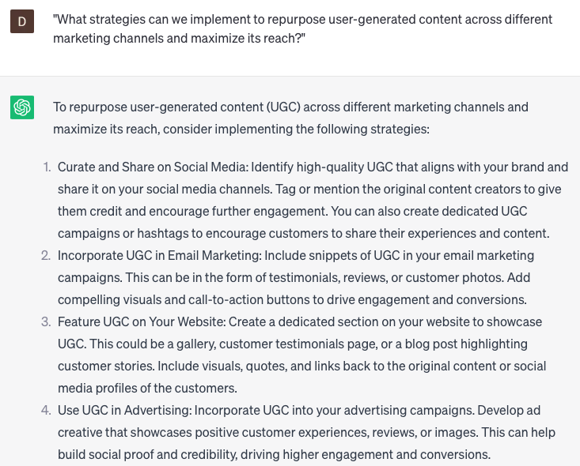

# Utilizing user-generated content

### FILL-IN-THE-BLANK **PROMPTS:**

```jsx
What are the prevailing themes and sentiments found in user-generated content associated with **[product/service]**?
```

```jsx
In what ways can we leverage user-generated content to enhance our marketing strategy specifically tailored for **[target audience]**?
```

```jsx
Could you conduct an analysis of the tone and sentiment found in user-generated content concerning **[brand/product]**, and subsequently provide practical insights based on the findings?
```

### QUESTIONS-BASED P**ROMPTS:**

1. "How can we effectively leverage user-generated content to enhance our brand presence and engage with our audience?"
2. "What strategies can we employ to encourage customers to create and share user-generated content related to our products or services?"
3. "Are there any specific platforms or channels we should focus on to collect and showcase user-generated content?"
4. "How can we ensure the authenticity and quality of user-generated content before featuring it in our marketing efforts?"
5. "What measures can we take to recognize and reward customers for creating and sharing valuable user-generated content?"
6. "Are there any legal or privacy considerations we should keep in mind when utilizing user-generated content in our marketing campaigns?"
7. "How can we effectively moderate and manage user-generated content to maintain a positive brand image and prevent any misuse?"
8. "What steps should we take to engage with users who contribute user-generated content and foster a sense of community?"
9. "How can we track and measure the impact of user-generated content on our marketing efforts and overall brand perception?"
10. "What strategies can we implement to repurpose user-generated content across different marketing channels and maximize its reach?"

### EXAMPLES:

