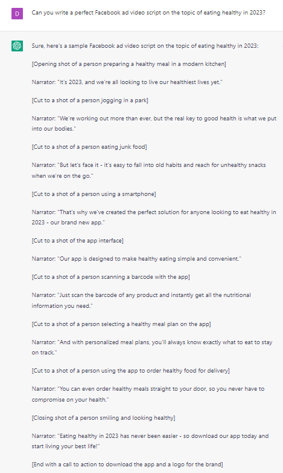

# Writing Facebook ad video scripts

### FILL-IN-THE-BLANK PROMPTS**:**

```jsx
Can you write a **[type of text]** on the topic of **[subject] [additional details]**?
```

```jsx
Can you write a super engaging Facebook ad video script on **[topic]**?
```

```jsx
Write a script outline for a 2 minute video to sell **[product]** to **[audience]**, mentioning the following benefits:
**[Benefit 1]
[Benefit 2]
[Benefit 3].**
```

### OPEN-ENDED PROMPTS**:**

1. “Can you write a script for a Facebook ad video promoting our new product?”
2. “I need a script for a Facebook ad video that showcases the benefits of our service. Can you help?”
3. “Our Facebook ad video needs a script that will grab people's attention and encourage them to take action. Can you write it?”
4. “Can you create a Facebook ad video script that highlights the unique features of our product and why it's better than the competition?”
5. “I'm looking for a Facebook ad video script that tells a story and connects with our audience emotionally. Can you help with that?”
6. “We want our Facebook ad video to be funny and memorable. Can you write a script that will make people laugh and remember our brand?”
7. “Our Facebook ad video needs a strong call to action. Can you write a script that will encourage people to click, sign up, or buy?”
8. “Can you write a Facebook ad video script that speaks directly to our target audience and addresses their pain points and desires?”
9. “We're launching a new campaign and need a Facebook ad video script that will get people excited and curious. Can you help with that?”
10. “Our Facebook ad video needs to stand out from the crowd. Can you create a script that will grab people's attention and make them want to learn more?”

### EXAMPLES:

