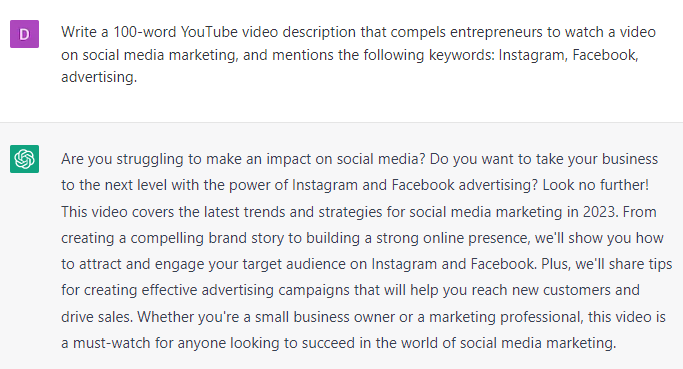
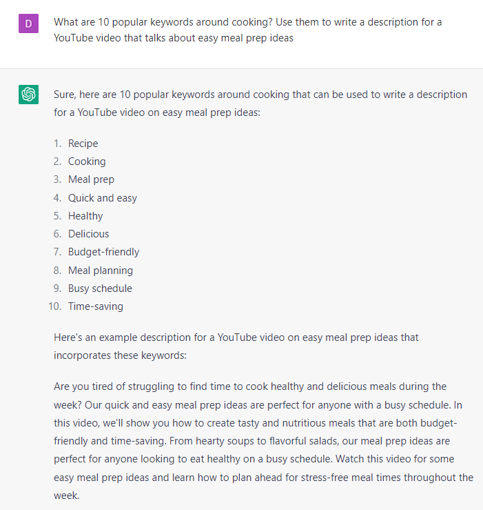

# Writing an SEO Friendly YouTube Video Description

### FILL-IN-THE-BLANK **PROMPTS:**

```jsx
Write a 100-word YouTube video description that compels **[audience]** to watch a video on **[topic]**, and mentions the following keywords **[keyword 1]**, **[keyword 2]**, **[keyword 3].**
```

```jsx
What are 10 popular keywords around **[topic]**? Use them to write a description for a YouTube video that talks about **[topic].**
```

### OPEN-ENDED **PROMPTS:**

1. “Can you help me optimize my YouTube video description with relevant keywords for my video on [fill in the topic]?”
2. “I'm looking for assistance in writing a compelling and SEO-friendly description for my latest YouTube video about [fill in the topic]. Can you help me with that?”
3. “Can you create a YouTube video description that includes the right keywords and phrases to help my video rank higher in search results for [fill in the topic]?”
4. “I need a YouTube video description that will appeal to my target audience and also help improve the video's SEO ranking for [fill in the topic]. Can you assist me with that?”
5. “Can you write a detailed and keyword-rich description for my YouTube video that covers [fill in the topic], and also includes a call-to-action?”
6. “I'm looking for help in writing an SEO-friendly description for my YouTube video on [fill in the topic]. Can you create something that is engaging and informative?”
7. “Can you help me write a YouTube video description that not only explains what my video is about but also includes relevant keywords and phrases for [fill in the topic]?”
8. “I need a YouTube video description that will help my video rank higher in search results for [fill in the topic]. Can you write something that is both informative and optimized for search engines?”
9. “Can you write a YouTube video description that includes relevant keywords, summarizes the content of my video on [fill in the topic], and encourages viewers to watch it?”
10. “I'm looking for assistance in writing an engaging and SEO-friendly description for my YouTube video on [fill in the topic]. Can you help me create something that will attract viewers and also improve its SEO ranking?”

### EXAMPLES:



