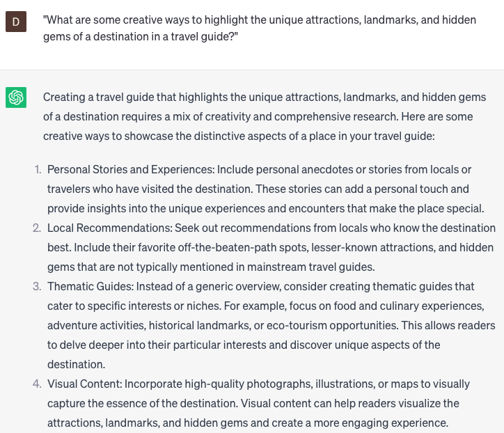

# Writing destination guides

### FILL-IN-THE-BLANK **PROMPTS:**

```jsx
Could you assist me in brainstorming some distinctive **[activity/attraction]** ideas to include in my travel guide for **[city/region]**?
```

```jsx
For individuals interested in writing destination guides, what key elements and tips should they consider to **[provide comprehensive information/capture the essence of the place/engage readers]**?
```

```jsx
I'm in the process of compiling a travel guide for **[country/city]** and would like to feature some budget-friendly recommendations. Can you provide suggestions for affordable **[activity/attraction/restaurant]** options that I can include?
```

### QUESTIONS-BASED P**ROMPTS:**

1. "How can I effectively capture the essence of a destination in a comprehensive and engaging travel guide?"
2. "Can you provide tips for conducting thorough research to gather accurate and up-to-date information for writing destination guides?"
3. "What are some creative ways to highlight the unique attractions, landmarks, and hidden gems of a destination in a travel guide?"
4. "Are there any recommended structures or formats for organizing and presenting information in a destination guide for easy readability?"
5. "Can you suggest strategies for incorporating personal experiences and anecdotes to add authenticity and relatability to a destination guide?"
6. "What are some effective methods for showcasing the local culture, traditions, and customs of a destination in a travel guide?"
7. "Are there any important considerations for providing practical information such as transportation options, accommodation, and dining recommendations in a destination guide?"
8. "Can you provide insights on balancing factual information with subjective recommendations and opinions in a destination guide?"
9. "What are some ways to engage readers and make a destination guide more interactive, such as including maps, photos, or user-generated content?"
10. "How can I ensure that my destination guide remains relevant and useful to readers by regularly updating and revising the information?"

### EXAMPLES:

