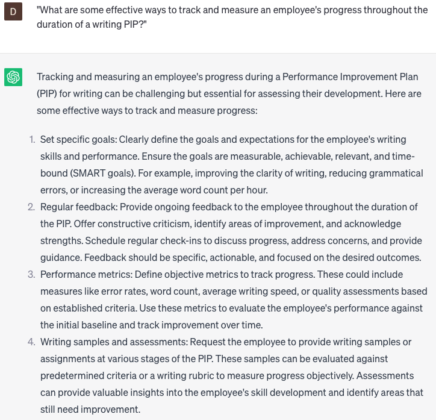

# Writing performance improvement plans

### FILL-IN-THE-BLANK **PROMPTS:**

```jsx
Could you assist me in crafting a performance improvement plan for **[employee name]**, who is encountering challenges in **[specific area requiring improvement]**? Several instances of their subpar performance consist of **[specific examples of underperformance]**. I aim to witness enhancements in **[specific goals or metrics]** within **[specified timeframe]**.
```

```jsx
Can you furnish me with appropriate language to incorporate into a performance improvement plan, motivating **[employee name]** to assume responsibility for their performance in **[specific area requiring improvement]**? While I have previously employed phrases such as **[specific language examples]**, I'm seeking further suggestions to enhance the plan's effectiveness.
```

```jsx
What strategies can I employ to create a performance improvement plan that is transparent and actionable for **[employee name]**, as they endeavor to enhance their **[specific area requiring improvement]**? I intend to incorporate **[specific sections or elements]** into the plan while ensuring it is customized to address **[employee name]**'s individual needs and goals.
```

### QUESTIONS-BASED P**ROMPTS:**

1. "What are the key components of a well-crafted performance improvement plan (PIP) that effectively addresses writing deficiencies?"
2. "How can a manager or supervisor ensure that a writing PIP is tailored to the specific needs and challenges of an individual employee?"
3. "What strategies can be incorporated into a writing PIP to enhance the employee's grammar and punctuation skills?"
4. "In what ways can a writing PIP encourage employees to develop their vocabulary and improve their word choice?"
5. "How can a writing PIP address issues related to clarity and conciseness in an employee's written communication?"
6. "What techniques can be employed in a writing PIP to help employees organize their thoughts and improve the structure of their written work?"
7. "What role can regular feedback and coaching play in supporting an employee's progress within a writing PIP?"
8. "How can a writing PIP foster the development of proofreading and editing skills among employees?"
9. "What resources or tools can be recommended within a writing PIP to assist employees in improving their writing, such as grammar checkers or style guides?"
10. "What are some effective ways to track and measure an employee's progress throughout the duration of a writing PIP?"

### EXAMPLES:

