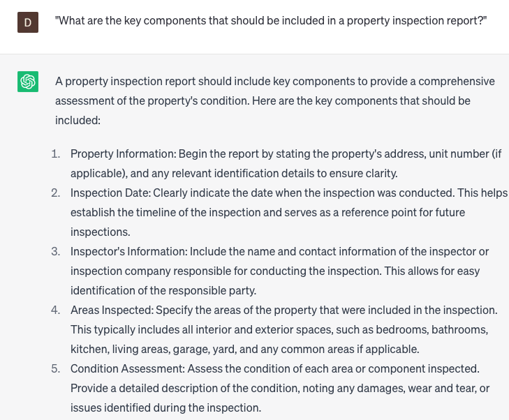

# Writing property inspection reports

### FILL-IN-THE-BLANK **PROMPTS:**

```jsx
I need a comprehensive property inspection report for **[property address]**. The report should encompass thorough evaluations of the **[foundation, roof, HVAC system, plumbing, electrical, windows, doors, and insulation]**, accompanied by specific recommendations for any required repairs or replacements. Additionally, please suggest any potential upgrades or improvements that can enhance the property's **[safety, value, or energy efficiency]**.
```

```jsx
Drawing on guidance from 'Every Landlord's Legal Guide', could you aid me in creating an exhaustive evaluation of the **[landscaping, drainage, irrigation, or outdoor amenities]** for my property located at **[property address]**? This should encompass a thorough assessment of elements such as the **[trees, shrubs, lawn, patio, deck, pool, or outdoor lighting]**, along with the identification of any prospective safety risks. Additionally, I'm seeking specific suggestions for enhancements or updates that could augment the property's **[value, appeal, or functionality].**
```

```jsx
Generate a comprehensive report on the **[condition, age, and quality]** of the **[flooring, walls, ceilings, doors, or windows]** in the property located at **[property address]**. The report should include assessments of any potential safety hazards and provide specific recommendations for necessary repairs or replacements that can enhance the property's **[safety, value, or energy efficiency]**.
```

### QUESTIONS-BASED P**ROMPTS:**

1. "What are the key components that should be included in a property inspection report?"
2. "How do you effectively document and describe the condition of different areas of a property in an inspection report?"
3. "What are some common challenges or pitfalls to avoid when writing property inspection reports?"
4. "How can you ensure objectivity and fairness in your assessment when writing a property inspection report?"
5. "What strategies can be employed to effectively communicate any safety hazards or concerns in a property inspection report?"
6. "What are some best practices for organizing and structuring a property inspection report to enhance readability and comprehension?"
7. "How can you provide detailed and accurate measurements and specifications in a property inspection report?"
8. "What are the essential elements to include when documenting any damages or maintenance issues in a property inspection report?"
9. "How do you incorporate relevant regulations and compliance requirements into a property inspection report?"
10. "What are some effective techniques for providing recommendations or suggestions for improvements in a property inspection report?"

### EXAMPLES:

