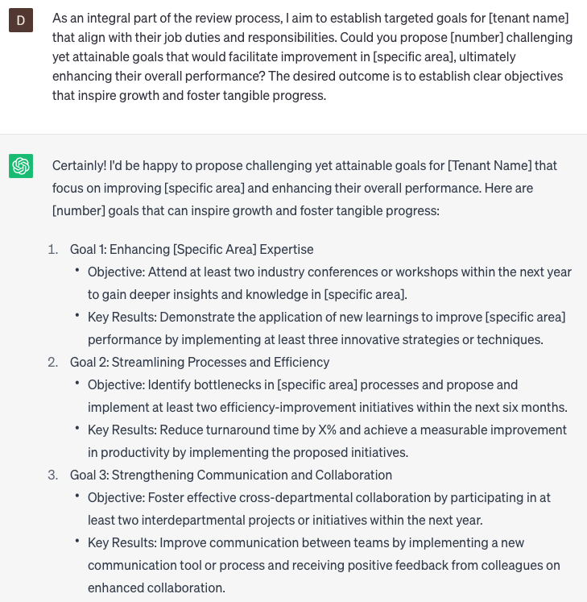

# Writing tenant performance reviews

### FILL-IN-THE-BLANK **PROMPTS:**

```jsx
Assist me in drafting a performance review for **[tenant name]**, which highlights their accomplishments in **[specific area]**, identifies **[number]** areas for potential improvement, and evaluates their overall **[quality]** and **[quality]**. Furthermore, I want a discussion on their proficiency in **[ability]** and **[ability]**. The expected outcome is a well-crafted performance review that provides a balanced assessment and sets clear expectations for future growth.
```

```jsx
Help me give constructive feedback to **[tenant name]** that effectively recognizes their **[quality]** and **[quality]**, while also offering actionable suggestions for improvement in **[specific area]**. Could you support me in drafting language that strikes a diplomatic tone while providing tangible guidance for their growth? The intended outcome is to deliver feedback that fosters positive development and encourages progress.
```

```jsx
As an integral part of the review process, I aim to establish targeted goals for **[tenant name]** that align with their job duties and responsibilities. Could you propose **[number**] challenging yet attainable goals that would facilitate improvement in **[specific area]**, ultimately enhancing their overall performance? The desired outcome is to establish clear objectives that inspire growth and foster tangible progress.
```

### QUESTIONS-BASED P**ROMPTS:**

1. "What specific achievements and contributions has [TENANT NAME] made during the review period that demonstrate their exceptional performance?"
2. "In what areas has [TENANT NAME] shown significant growth and improvement since their last performance review?"
3. "Can you provide examples of how [TENANT NAME] consistently meets or exceeds expectations in their assigned job duties?"
4. "What specific skills or qualities does [TENANT NAME] possess that contribute to their effectiveness in their role?"
5. "What areas of development or improvement have been identified for [TENANT NAME] to enhance their performance further?"
6. "How does [TENANT NAME] effectively handle challenging situations or unexpected obstacles?"
7. "Can you highlight instances where [TENANT NAME] has demonstrated strong teamwork and collaboration with colleagues?"
8. "In what ways does [TENANT NAME] display exceptional customer service and satisfaction in their interactions with tenants or clients?"
9. "Can you provide examples of how [TENANT NAME] consistently meets deadlines and effectively manages their workload?"
10. "What opportunities or resources can be provided to support [TENANT NAME]'s continued growth and success in their role?"

### EXAMPLES:

