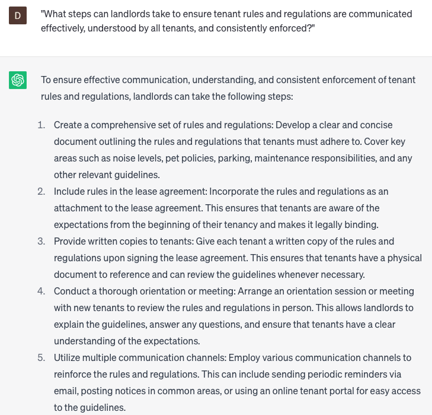

# Writing tenant rules and regulations

### FILL-IN-THE-BLANK **PROMPTS:**

```jsx
I need guidance on how to handle **[specific issue]** within my tenant rules and regulations. Specifically, I am seeking information regarding **[additional details]**, as well as any relevant **[law/regulation/standard]** that I should take into account.
```

```jsx
Could you guide me on structuring my tenant rules and regulations to best approach the **[specific topic]**? I'm aiming to create **[number]** of distinct sections that are logically organized, ensuring the document is comprehensive yet easily understood by asking probing questions to clarify each point?
```

```jsx
I would like to compile a thorough set of rules and regulations for my tenants, but I'm uncertain about where to start. Could you provide guidance on the key areas that require attention and offer sample language for **[specific rule/regulation]**? Please consider any pertinent **[laws/regulations/standards]** that I should be mindful of while formulating the rules.
```

### QUESTIONS-BASED P**ROMPTS:**

1. Why is it crucial for landlords to establish clear and concise tenant rules and regulations? How do they contribute to a harmonious living environment?"
2. "In what ways can a well-written set of tenant rules and regulations promote safety and security within the rental property?"
3. "How can clearly defined rules regarding noise levels and quiet hours contribute to the comfort and well-being of all tenants?"
4. "What role do tenant rules and regulations play in ensuring the proper maintenance and care of shared spaces and amenities?"
5. "How can tenant rules and regulations address the issue of pet ownership, including restrictions, responsibilities, and potential consequences?"
6. "What measures can be included in tenant rules and regulations to address proper waste disposal and encourage recycling or sustainable practices?"
7. "How can tenant rules and regulations address parking arrangements, visitor policies, and any associated fees or permits?"
8. "Why is it important for tenant rules and regulations to include provisions regarding lease termination, subletting, or any other potential changes to the tenancy agreement?"
9. "How can tenant rules and regulations help landlords manage and address issues related to late rent payments, maintenance requests, or other common tenant concerns?"
10. "What steps can landlords take to ensure tenant rules and regulations are communicated effectively, understood by all tenants, and consistently enforced?"

### EXAMPLES:

